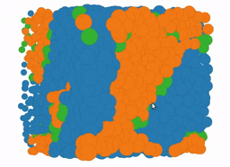
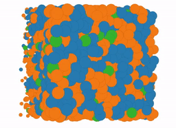

# dpd-baremetal
A tinsel-based version of the DPD application

| real-time example | slowed down |
| ----------------- | ----------- |
|  |  |
|  |  |

An oil-and-water demo (ran on Byron: 2D = 100 threads, 3D = 1000 threads).
 
It consists of two main parts:
* __[the application]__ this run's the simulation on the POETS box
* __[the client]__ this is a web-based GUI that displays the simulation in real-time and allows simulation playback

To connect the client and the application a user must have ssh key-based authetification access to the POETS box where the application is running and must edit the following lines of `dpd-baremetal/Makefile`:

```bash
  # ~~~~~~~~~~~~~~~ Client side setup ~~~~~~~~~~~~~~~~~~~~~~~~~
  LOCAL_SOCKET=./_external.sock
  REMOTE_FULL=sf306@byron.cl.cam.ac.uk
  REMOTE_SOCKET=/home/sf306/dpd-baremetal/bin/_external.sock
```
Where:
* `LOCAL_SOCKET` is the name of the socket for the socket on the client side that is connected to the remote socket using `socat`.
* `REMOTE_FULL` is the username of the user and the address of the POETS box where the application will be executed.
* `REMOTE_SOCKET` is the name of the socket on the POETS box that is created by the application

## install requirments

* `libboost`
* `socat`

To build on the client-side:
```bash
 make bridge 
```

To build on the remote application side (POETS box):
```bash
make
```

## running the default
On the POETS box you can start the application with the following:
```bash
cd bin; ./run
```

You then need to start the client side before `running...` appears on the POETS box application. This can be done by typing the following on the client machine:
```bash
make client_run
```

Once the application is running the web-interface can be launched from the client machine by opening `http://localhost:3000`. From here the user can watch a live output of the simulation and play the simulation back from the start at a faster framerate. 

## implmentation details

Currently this application is mainly built around POLite -- although the ultimate goal is to modify POLite to create a more application specific code base. The current implementation also makes use of the latest Tinsel idle-detection features to make globally synchronus transition changes between the update, migration, and emit phases of the computation. The plan is ultimately to play with the synchronisation and see how it effect performance.
